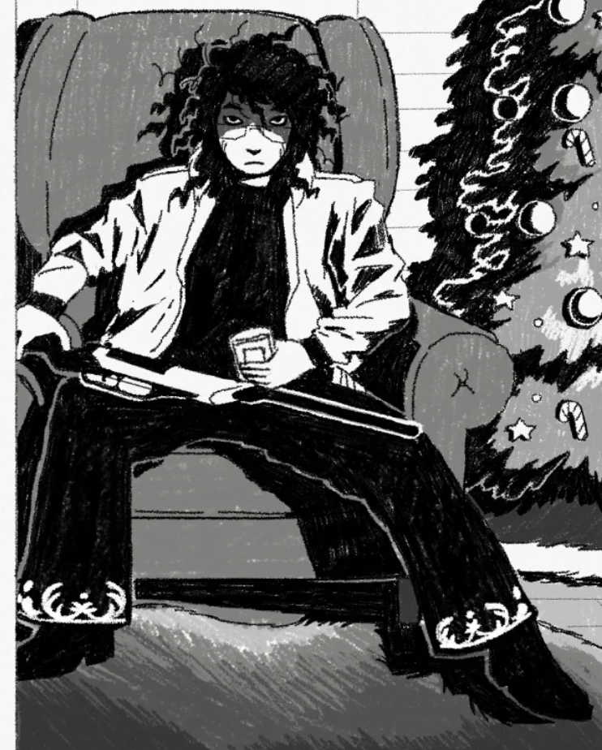
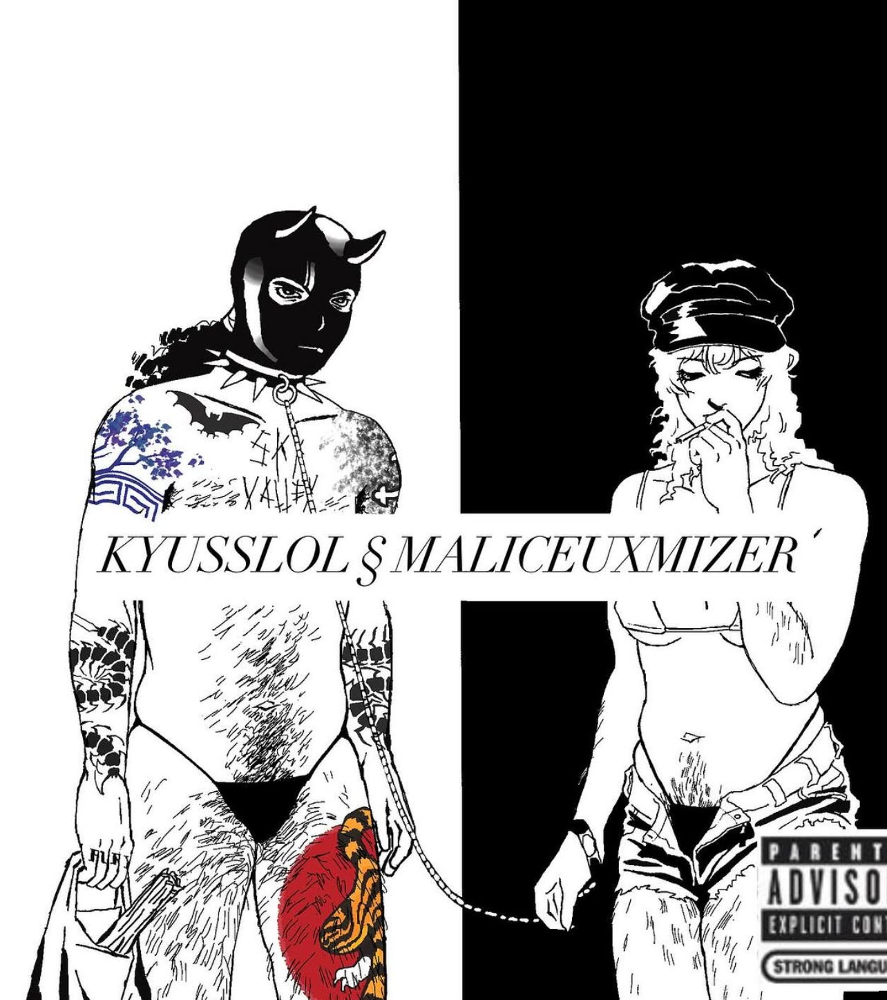
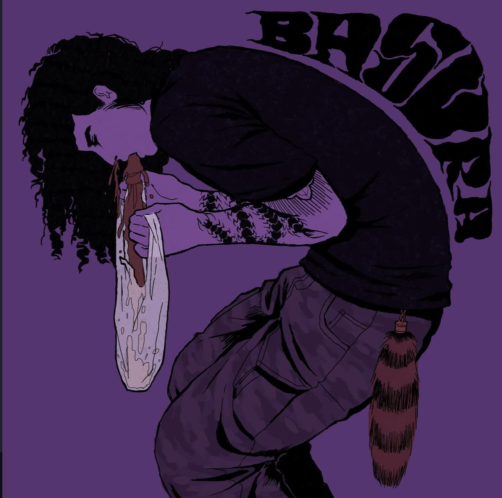
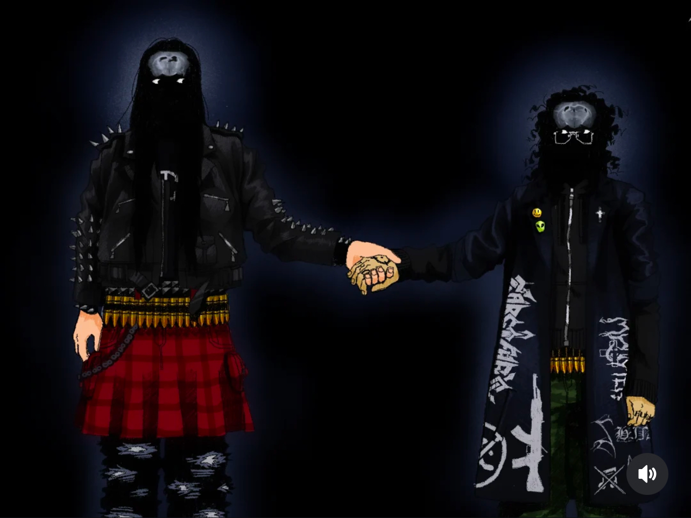

#### full-sized prices are as follows:
###### please note: these are just some approximate examples taken from my personal art, of course - you will get to dictate the final details of what you would like YOUR piece to look like!

- $85 for a black and white piece
  ###### like this!

  

- $90 for a flat color
  ###### like this!

  

  
- $95 for a basic, monochrome cell shaded render
  ###### like this!

  

  
- $100 for a more detailed render with more than two tones
  ###### like this!

  

  

###### click on the cross stitch to go back, and the floppydisk to go home
 
