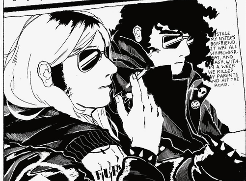
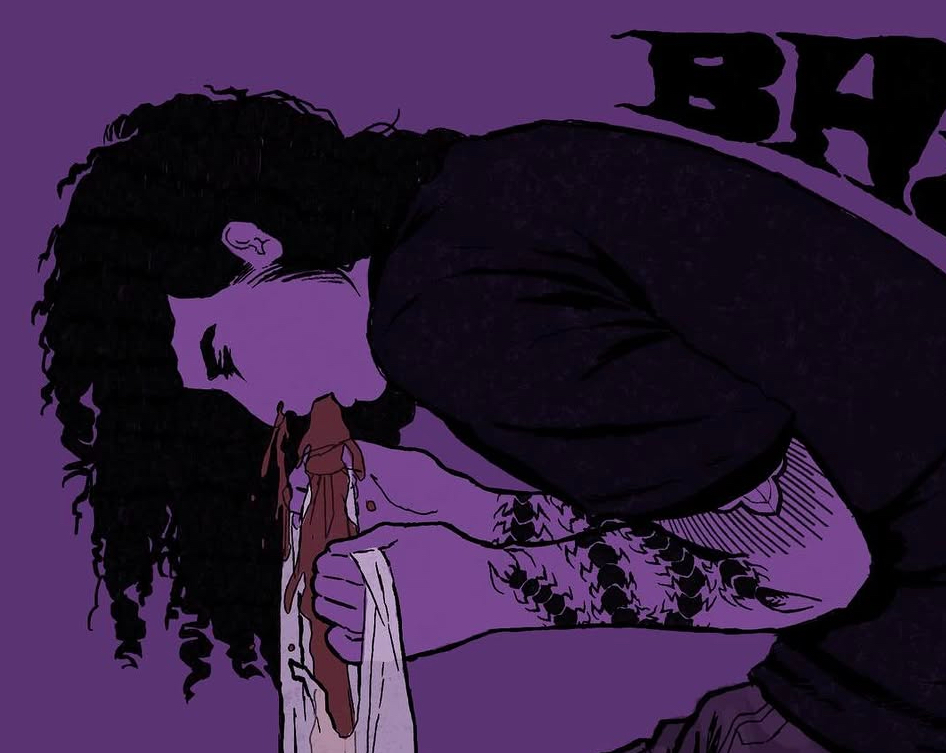
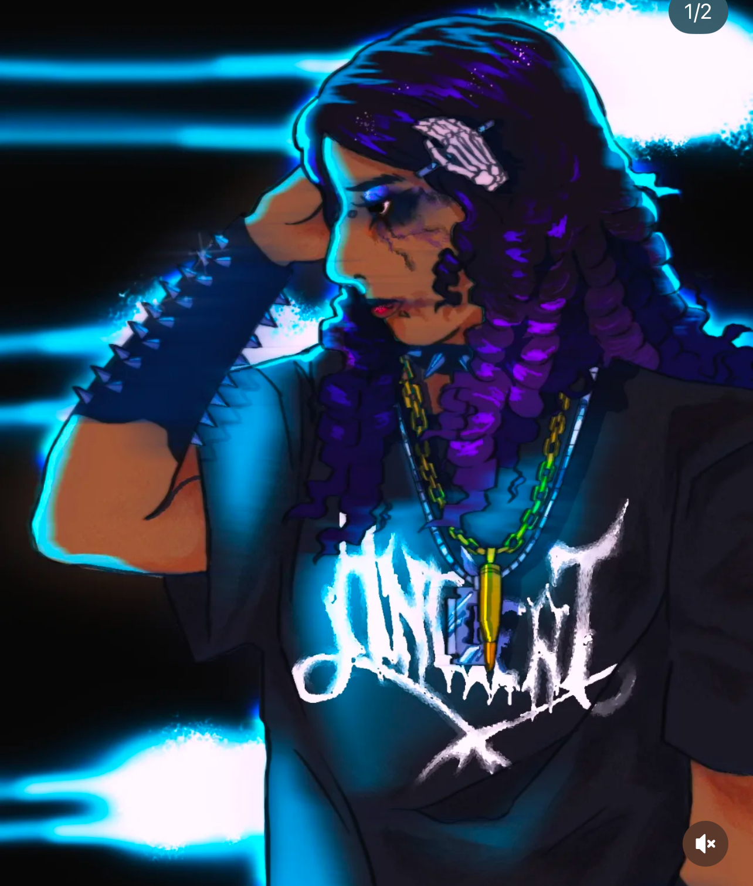

#### half-sized prices are as follows:
- $70 for a black and white piece
  ###### like this!
  

  

- $75 for a basic, monochrome cell shaded render 
  ###### like this!

  

  - $80 for a more detailed render with more than two tones
  ###### like this!
  

  

 

###### click on the cross stitch to go back, and the floppydisk to go home
 
