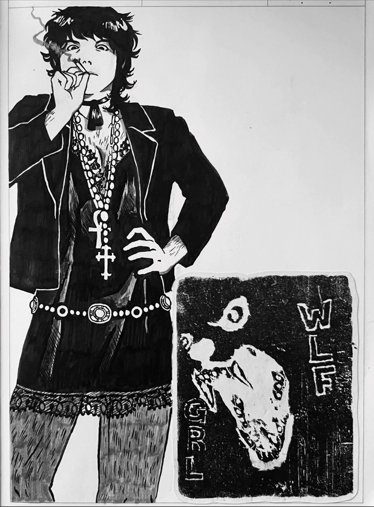

#### hey! due to some interest, i decided i would start taking traditional commissions; where i draw your piece physically on a piece of some nice thick paper (or canvas) and mail it to you!

#### since i'm just starting this, i'll only be taking black and white (with the possibility for some simple high contrast cell shading) just to start and see how this goes and how people like it

#### here are some notes about this:
- base rates will be the same as all of the black and white digital commissions
- if you'd like to have your piece on a piece of nice paper (like some cardstock or high GSM paper) i won't charge you anything for materials
- i also won't charge anything for sizes from small to (approximately) A4 sized, anything larger we can negotiate what you think sounds fair based on how much larger you'd like the piece to be
- if you'd like your piece to be on canvas, i will charge a materials fee only for how much it costs to purchase the canvas of your choice. we can talk about which one you'd like and where i can go purchase it, then you can send me half of the estimated fee, then the remainder after i actually purchase the canvas and send you the receipt
- ***i unfortunately will have to add the shipping fee to your base fee for the artwork, i would be shipping from canada and some of our rates get a bit crazy to pay out of pocket after already having done the labor, apologies again!***

#### here are some examples of my traditional work, if you're wondering if you want to purchase some (as always, more can be found on my instagram, which i update more frequently!): 
###### another note: these are some of my personal works, so of course, everything would be tailored to your liking

   

